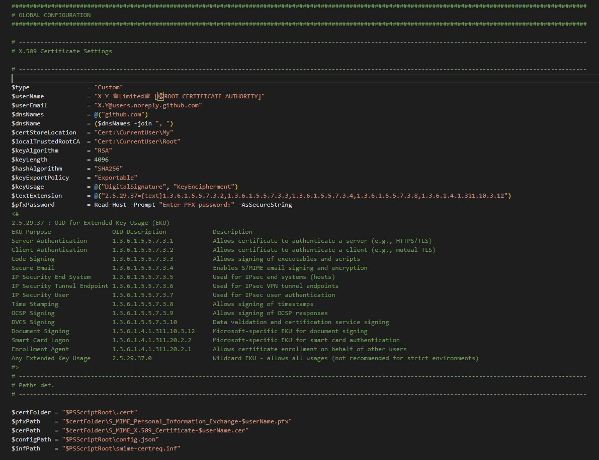
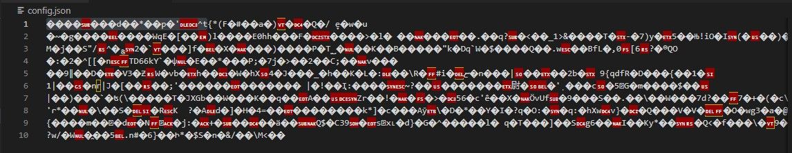
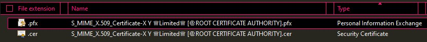
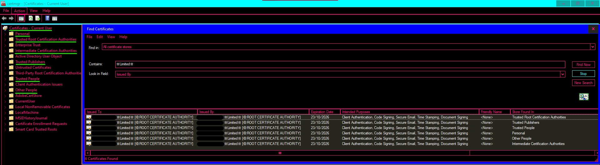
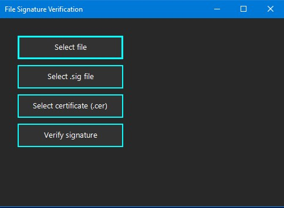
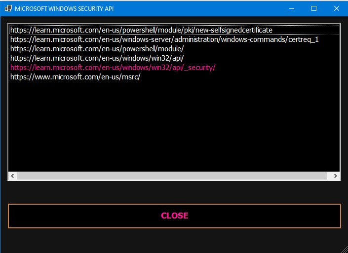
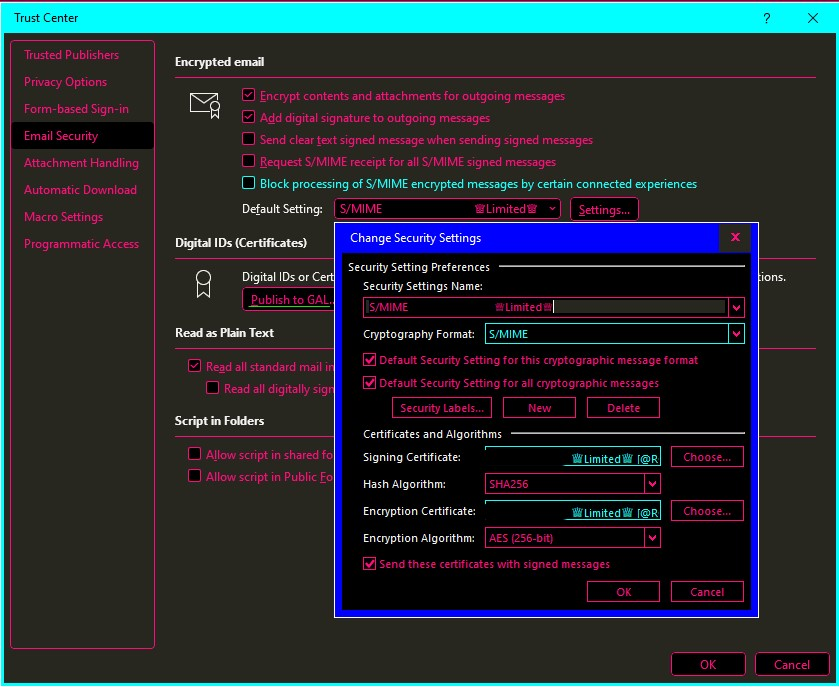
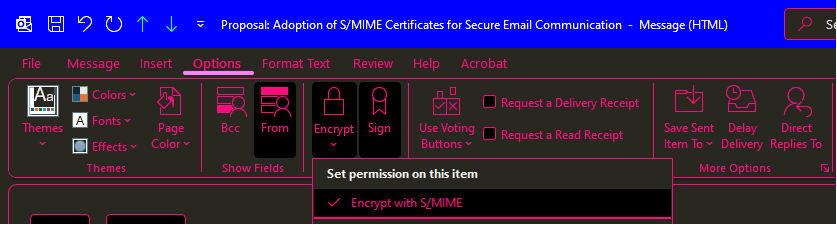

### S/MIME Email Certificate Generator 

### Objectives
- Generate and install a personal, self-signed S/MIME certificate for secure email communication in Windows environments
- Educational purposes

### Purpose
This PowerShell-based solution creates a valid S/MIME certificate issued by a self-signed local Certificate Authority (CA), linked to the current Windows user. It integrates with Microsoft Outlook to enable encrypted and signed email exchange.

### Implementation Steps
1. Generate certificate (.pfx)
2. Install certificate to the user store
3. Trust the certificate by importing the CA root
4. Export and share the public key (.cer)
5. Cache the certificate in Outlook for encryption and signing
6. Use the certificate for secure email communication

### S/MIME Overview
S/MIME includes:
- **Private key**, **public key**, and **Secure Email EKU**
- **Encryption**: AES-256
- **Digital signing**: SHA-256
- **Integrity**: SHA-256 hashing
- **Authentication**: RSA (4096-bit key)

> Ciphers and algorithms are configurable.

### Prerequisites
- Logged-in Windows user (Windows 10+ or Windows Server 2008+)
- Microsoft Outlook (2016 or later)
- Configured email account in Outlook

### Source Code Description

##### 1. Configuration Generator
##### `config.ps1`   
- Creates `config.json`  
- Creates `smime-certreq.inf`


##### 2. AES Key Generator
##### `aes_256.ps1`    
- Creates `aes_256.key`

##### 3. Config Encryption 
##### `encrypt.ps1`    
- Encrypts `config.json`  
- Encrypts `smime-certreq.inf`



##### 4. Config Decryption
##### `decrypt.ps1`  
- Decrypts `config.json`  
- Decrypts `smime-certreq.inf`

##### 5. Certificate Lifecycle
##### `x509_cert.ps1`    
- Creates, exports, and imports certificate  
- Certificate is imported to:
  - Personal
  - Trusted Root Certification Authorities
  - Intermediate Certification Authorities
  - Trusted People
  - Trusted Publishers
  - Other People

>To verify use `Win+R → certmgr.msc` or PowerShell function `Get-LocalTrustedRootCA` from `utils.ps1`

 



##### 6. Utility Functions
##### `utils.ps1`

##### 7. File Signature Verification
##### `file_signature_verifier.ps1`   


##### 8. PowerShell PKI API Reference
##### `doc_ps_api.ps1`   
- Educational script printing PKI API usage in terminal

  

##### 9. Windows API Reference
##### `doc_win_api.ps1` 
- Educational script printing Windows API usage in a Windows Forms app

  

### Outlook Integration
To publish the certificate in Outlook:

Outlook → File → Options → Trust Center → Trust Center Settings → Email Security → Settings → Publish certificate in Global Address List



  

### Testing
#### Recommended Testing Process Related to Outlook Caching

| Action | Outlook Caching |
| :------------- |:-------------|
| Sign email to yourself | Outlook stores your public key in the Sent Items and caches it for future use |
| Encrypt email to yourself | Outlook uses existing public key - no new caching |
| Receive signed email | Outlook caches the sender’s public key for future encryption |
| Send signed email to someone else | Their email client may cache your public key if it supports S/MIME |


### 🐞Potentially issues and workaround (PowerShell code)
```
############################################################################################################
# UTILS FILE 
############################################################################################################
# CONFIGURATION OF MICROSOFT OUTLOOK TRUST CENTER SECURITY
############################################################################################################
# ----------------------------------------------------------------------------------------------------------
# Objective: Prevent the hash algorithm from being overwritten by MS Outlook Trust Center
# -----------------------------------------------------------------------------------------------------------
# Set SHA-256 hash as default hash algorithm for signing emails with Outlook
# -----------------------------------------------------------------------------------------------------------
# Function definition:  
# -----------------------------------------------------------------------------------------------------------
function Set-SHA256_Email_Security_Settings {
    # Get the latest installed version of Microsoft Office
    # Define registry path
    $officeKey = "HKLM:\Software\Microsoft\Office"
    # Get all subkeys that match version numbers
    $officeVersions = Get-ChildItem -Path $officeKey | Where-Object { $_.PSChildName -match '^\d+\.\d+$' }
    # Sort and select the highest version
    $latestOfficeVersion = ($officeVersions | Sort-Object PSChildName -Descending | Select-Object -First 1).PSChildName
    # Output the result
    Write-Host "Microsoft Office Version: $latestOfficeVersion"
    # Set hash algorithm to SHA-256 for the latest installed version of Microsoft Office.
    Set-ItemProperty -Path "HKCU:\SoftwareMicrosoft\Office\$latestOfficeVersion\Outlook\Security" -Name "DefaultSigningAlgOID" -Value "2.16.840.1.101.3.4.2.1"
    #Note: Key: DefaultSigningAlgOID | Value: 2.16.840.1.101.3.4.2.1 (It means set DefaultSigningAlg to SHA-256)
    Write-Host "SHA-256 hash is the signing algorithm for Outlook emails." -ForegroundColor Cyan
}
# -----------------------------------------------------------------------------------------------------------
# Function execution:  
# -----------------------------------------------------------------------------------------------------------
Set-SHA256_Email_Security_Settings
```

### 📄 License
This project is licensed under the [MIT License](./LICENSE). You are free to use, modify, and distribute the code with proper attribution.
